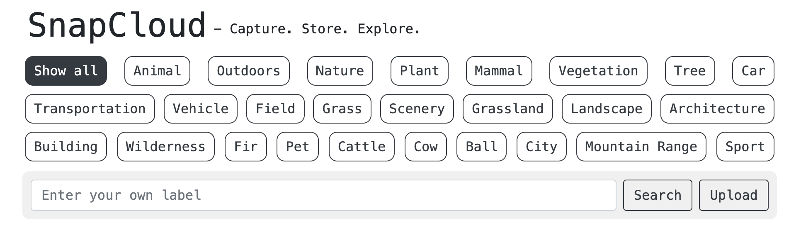

<p align="center">
    
</p>

# 🚀 Hi there!

**SnapCloud** is a web application designed to streamline image management using AWS S3 and
Rekognition services. It enables users to upload, store, and share images, as well as search
for images based on detected labels.

### Features:

- **Upload Images**: Upload images to cloud with a simple interface.
- **Label Cloud**: Visualize the most common labels associated with uploaded images in a tag cloud
  format.
- **Search by custom label**: Search for images by entering custom labels in the search bar.
- **Image Downloading**: Click on any image to open a modal preview with options to download the
  image.

### Tech Stack

- **Spring Boot**: Framework for crafting Java-based web applications.
- **Spring Web**: Framework for building web applications with Spring MVC.
- **Maven**: Build automation tool for managing dependencies and builds.
- **AWS S3**: Scalable storage for images and objects in the cloud.
- **AWS Rekognition**: Deep learning-based image analysis service for identifying objects, text,
  scenes, and activities in images.
- **JUnit**: Testing framework for Java applications.
- **Mockito**: Mocking framework for unit tests in Java.
- **Docker**: Platform for containerizing applications.
- **Testcontainers**: Library for integration testing with Docker containers.

## AWS Setup Instructions

Follow these steps to configure AWS S3 bucket and AWS Rekognition:

### 1. Create AWS S3 Bucket:

#### Step-by-step Guide:

1. **Log in to AWS Management Console:**
    - Navigate to [AWS Management Console](https://aws.amazon.com/console/) and log in with your
      credentials.

2. **Navigate to S3 Service:**
    - In the AWS Management Console, find and select the **S3** service.

3. **Create a New Bucket:**
    - Click on the **Create bucket** button.
    - Enter a **unique bucket name**. Bucket names must be globally unique across AWS.
    - Select the **region** where you want to create the bucket.
    - Configure other options as needed (such as versioning, logging, tags).
    - Click **Create bucket**.

4. **Note down Bucket Name and Region:**
    - After successfully creating the bucket, note down the **Bucket Name** and **Region**.
      You'll need these for your application configuration.

### 2. Generate IAM User Credentials:

#### Step-by-step Guide:

1. **Navigate to IAM Service:**
    - In the AWS Management Console, find and select the **IAM** service.

2. **Create or Use an Existing IAM User:**
    - Click on **Users** in the left navigation pane.
    - Either create a new IAM user or select an existing IAM user that you want to use for
      accessing AWS services (S3 and Rekognition).

3. **Add Permissions:**
    - Click on the IAM user to open its details.
    - Navigate to the **Permissions** tab.
    - Click **Add permissions** and choose the policies that grant access to S3 and Rekognition
      services. Example policies include:
        - `AmazonS3FullAccess`: Provides full access to Amazon S3 resources.
        - `AmazonRekognitionFullAccess`: Provides full access to Amazon Rekognition.

4. **Generate Access Key ID and Secret Access Key:**
    - In the IAM user details, navigate to the **Security credentials** tab.
    - Click **Create access key** if no keys exist, or **Generate new access key** if you need
      to create new keys.
    - Note down the **Access Key ID** and **Secret Access Key**. These credentials are used by
      your application to authenticate AWS API requests.

    > [!IMPORTANT]
    > Note that the region for Rekognition must match the region for your S3 bucket.

## Installation

1. Clone the repository:
    ```bash
   git clone https://github.com/nklimovych/aws-snapcloud.git
   cd aws-snapcloud
   ```
2. Set Environment Variables:

   Set up an `application.propperties`, populate it with the following environment variables:
    ```properties
    spring.application.name=snapcloud
    
    aws.bucket.name=${AWS_BUCKET_NAME}
    aws.bucket.region=${AWS_BUCKET_REGION}
    aws.access.key=${AWS_ACCESS_KEY}
    aws.secret.key=${AWS_SECRET_KEY}
    
    server.servlet.context-path=/
    ```
> [!IMPORTANT]
> Remember to add your environment variables along with your credentials.

3. Build and Run the Docker Containers:

   ```bash
   docker-compose up --build
   ```
4. Access the Application:

   Open your browser and go to http://localhost:8080/ to access the app.
5. Stop and Remove Containers:

   To stop and remove the containers created by the Compose file, use the
   docker-compose down command:

    ```bash
    docker-compose down
    ```

### 🔐 Endpoints:

* 🚀 Upload an image: `POST /api/images/upload`

  Request Body:
   ```json
    {
      "file": "image-file.jpg"
    }
   ```
  Response (Happy case):
   ```json
   {
     "name": "image-name.jpg",
     "url": "https://your-bucket.s3.region.amazonaws.com/image-name.jpg",
     "tags": [
       "Nature",
       "Water",
       "Turtle",
       "Reptile",
       "..."
     ]
   }
  ```

  Response (Error):
   ```json
   {
     "time": "2024-07-01T12:56:46.719761",
     "status": "CONFLICT",
     "error": [
       "Image with the same name already exists: image-name.jpg"
     ]
   }
   ```

* 🏷️ Search images by label: `GET /api/images/search?label=your-label`
    ```json
   [
     "https://your-bucket.s3.region.amazonaws.com/image1-name.jpg",
     "https://your-bucket.s3.region.amazonaws.com/image2-name.jpg",
     "https://your-bucket.s3.region.amazonaws.com/image3-name.jpg"
   ]
    ```

* 👀 Retrieve all images: `GET /api/images/all`
   ```json
    [
     "https://your-bucket.s3.region.amazonaws.com/image1-name.jpg",
     "https://your-bucket.s3.region.amazonaws.com/image2-name.jpg",
     "https://your-bucket.s3.region.amazonaws.com/image3-name.jpg",
     "..."
     ]
   ```

* 🔥 Retrieve top labels: `GET /api/labels/top?limit=your-amount`
  ```json
    [
    "Animal",
    "Outdoors",
    "Nature",
    "Plant",
    "..."
    ]
  ```

---

## 👊 Faced Challenges

### Challenge 1: Learning New AWS S3 and Rekognition Features

Problem: Need to incorporate advanced features of AWS S3 and Rekognition quickly.

Solution: Dedicated time for research and hands-on experimentation.

Steps:

- Explore AWS documentation for the latest features in S3 and Rekognition.
- Implemented prototypes to understand integration points with existing application.
- Tested new features in a sandbox environment before production deployment.

### Challenge 2: Tight Deadlines

Problem: Short timelines for feature development and deployment.

Solution: Agile project management and efficient task prioritization. And OVERTIMING 😅

Steps:

- Used Agile methodologies to break down tasks into manageable sprints.
- Set clear goals and milestones for each sprint.
- Prioritized tasks based on impact and dependencies to meet deadlines effectively.

---

### 🥷 Author: [Nazar Klimovych](https://github.com/nklimovych) | [LinkedIn](https://www.linkedin.com/in/klimovych/)
